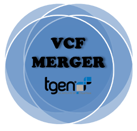

# vcfMerger2 
vcfMerger2 is a tool merger for 2 to N somatic variants vcf files. 

#### What is vcfMerger2?
This tool allows merging from 2 to N somatic vcfs obtained after running different variant callers using the same bam file(s). 

**vcfMerger2** will generate one vcf.   

 

#### How vcfMerger2 operates?
vcfMerger2 takes `RAW` VCFs as inputs and outputs a Merged VCF. [click here for the RAW VCF Definition] 

#### Somatic or Germline? 
VcfMerger2 has been developped to merge SOMATIC vcfs into one vcf. The current release can merge from 2 to N vcfs.  
To see the list  variant callers compatible with vcfMerger2 go to "Variant_Callers_compatible" wiki page

Merging GERMLINE vcfs will be available in the next version; some features are already there but are still under development and should be consider as in Alpha version. 

# How to Install 
See wiki [Installation](https://github.com/tgen/vcfMerger2/wiki/Installation#Installation) page

# How to run vcfMerger2?
The core utility and main purpose of that tool is to MERGE VCFs information into one VCF without losing any data from any of the input vcfs files
See [QuickStart](https://github.com/tgen/vcfMerger2/wiki/QuickStart#QuickStart) wiki page.

### License
vcfMerger2 is under MIT licence.
