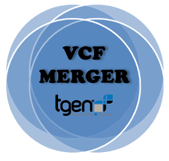

# `vcfMerger2` 
`vcfMerger2` is a tool merger for 2 to N somatic variants vcf files. 

#### What does `vcfMerger2`?
This tool allows the **merging** of 2 to N somatic `vcf` files obtained after running different variant callers using the same bam file(s). 

**vcfMerger2** will generate one vcf.   

 

#### How `vcfMerger2` operates?
`vcfMerger2` can take `RAW VCF` files as inputs and will output a `merged` VCF file.   
[click here](https://github.com/tgen/vcfMerger2/wiki/Glossary) for the definition of what we consider as `RAW VCF` and other definition.

#### Somatic or Germline? 
`vcfMerger2` has been developed to merge SOMATIC vcfs into one vcf.   
The current release can merge from 2 to N vcf files.  
To see the list  variant callers compatible with vcfMerger2 go to "Variant_Callers_compatible" **wiki page**

Merging GERMLINE vcfs will be available in the next version; some features are already there but are still under development and should be considered as in Alpha version [stalled development as of 2020-01-01]. 

# How to Install `vcfMerger2`
See wiki [Installation](https://github.com/tgen/vcfMerger2/wiki/Installation#Installation) page

# How to run `vcfMerger2`?
The core utility and main purpose of that tool is to **MERGE VCFs** information into one VCF without losing any data (`lossless`) from any of the input vcf files  
See [QuickStart](https://github.com/tgen/vcfMerger2/wiki/QuickStart#QuickStart) wiki page.

## Wiki Pages
For details on `vcfMerger2`, check the wiki pages at: [vcfMerger2 wiki](https://github.com/tgen/vcfMerger2/wiki)

### List of Tools vcfMerger2-compatible with prep step
Here is a list of tools for which `vcfMerger2` has pre-processing steps in place for making the vcf of these tools vcfMerger2-merger-compatible
- deepsomatic (v1.9 or up)
- lancet
- lancet2
- mutect2
- octopus
- strelka2
- vardict

#### Other Commands needed in PATH (if you built a container)
- awk
- bgzip
- rsync
- tabix
- .

All these names are valid tool names that can be used with the mandatory option `--toolnames`

### License
`vcfMerger2` is under MIT licence.
